# Star Reach — System Architecture Diagrams

> 작성일: 2026-04-24
> 기준: Godot 4.6, GDScript, 싱글 오프라인 (Mobile + Steam)
> 구현 검증: `star-reach/scripts/`, `star-reach/scenes/`, `star-reach/data/`

이 문서는 Star Reach의 시스템을 **8가지 관점의 Mermaid 다이어그램**과 **3가지 보조 다이어그램**(빌드 매트릭스 / IAP 플로우 / 마이그레이션)으로 시각화한다. 각 다이어그램은 서로 다른 질문에 답한다.

| # | 다이어그램 | 답하는 질문 |
|---|---|---|
| 1 | [카테고리 레벨 뷰](#1-카테고리-레벨-뷰-8대-분류) | 8개 대분류가 서로 어떻게 연결되는가? |
| 2 | [Autoload 의존성 그래프](#2-autoload-의존성-그래프) | 어떤 Autoload가 어떤 Autoload를 의존하는가? |
| 3 | [LAUNCH 시퀀스](#3-launch-단일-발사-시퀀스) | 플레이어가 LAUNCH 버튼을 누르면 무슨 일이 일어나는가? |
| 4 | [목적지 완료 팬아웃](#4-목적지-완료-팬아웃-승리-허브) | 목적지 완료 1건이 몇 개의 사이드 이펙트를 트리거하는가? |
| 5 | [3화폐 흐름](#5-3화폐-흐름-xp--credit--techlevel) | XP/Credit/TechLevel이 어디서 생기고 어디로 가는가? |
| 6 | [EventBus 시그널 맵](#6-eventbus-시그널-맵) | 어떤 도메인이 어떤 시그널을 송수신하는가? |
| 7 | [SaveSystem JSON 스키마](#7-savesystem-json-스키마-영속-데이터) | 플레이어 데이터는 어떻게 저장되는가? |
| 8 | [클라이언트 상태머신](#8-클라이언트-상태머신-메인--발사-중--시네마틱--오버레이) | 메인 / 발사 중 / 시네마틱 / 오버레이는 어떻게 전환되는가? |
| A | [플랫폼별 빌드 매트릭스](#a-플랫폼별-빌드-매트릭스) | Android / iOS / Steam Windows / Steam Linux는 어떻게 분기하는가? |
| B | [IAP 플로우](#b-iap-플로우) | 결제 트랜잭션이 어떻게 GameState 효과로 적용되는가? |
| C | [SaveSystem 마이그레이션](#c-savesystem-마이그레이션) | 스키마 v1 → v2 업그레이드는 어떻게 진행되는가? |

---

## 1. 카테고리 레벨 뷰 (8대 분류)

8개 대분류 간 주요 상호작용. Shell이 모든 시스템의 기반이고, Launch Core가 중심 루프, 나머지는 완료 이벤트로부터 fan-out.

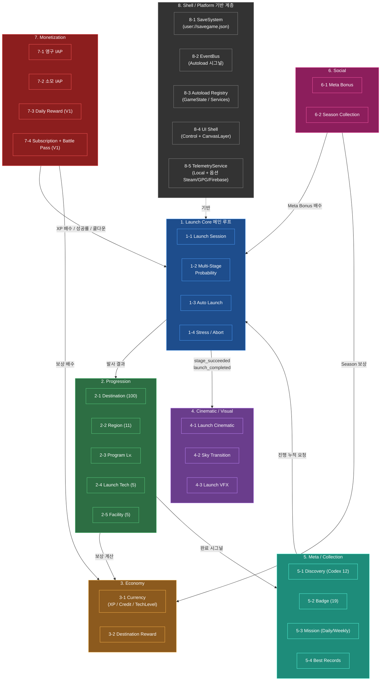

**핵심 읽기 순서**:
1. Shell(회색)이 모든 것의 기반 — Autoload 등록 / EventBus / SaveSystem
2. Launch Core(파랑)가 게임 코어 루프 소유
3. Progression/Economy(초록/주황)가 보상 구조
4. Cinematic(보라)은 연출, Meta(청록)는 장기 축
5. Social(핑크) + Monetization(빨강)이 Core/Economy에 **버프/배수**로 개입

---

## 2. Autoload 의존성 그래프

Godot Autoload로 등록된 싱글턴 서비스 간 의존 관계. Autoload는 `project.godot`에 선언되며 부팅 순서대로 `_ready()` 호출. **양방향 의존**(점선)은 직접 참조 대신 `EventBus` 시그널로 해결.

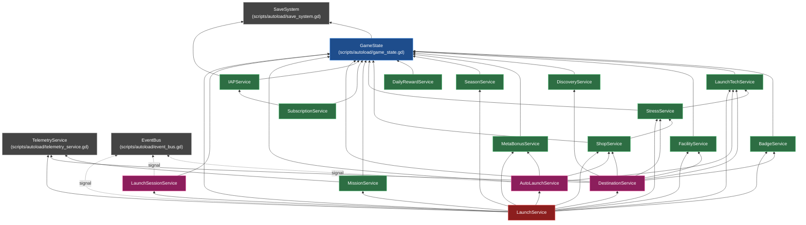

**관찰 포인트**:
- **Leaf**: `SaveSystem`, `TelemetryService`, `EventBus` — 어떤 Autoload도 의존하지 않음
- **State Hub**: `GameState` — 모든 도메인 서비스가 읽기/쓰기 대상
- **Top fan-in**: `LaunchService`(13개 서비스 + EventBus) — 실질 orchestrator
- **양방향 회피**: `LaunchService`, `AutoLaunchService`, `LaunchSessionService` 간 직접 참조 대신 `EventBus.launch_started`, `EventBus.auto_launch_toggled` 시그널로 결합

**Autoload 등록 순서** (`project.godot`):
1. `EventBus` — 모든 시그널 정의 (의존 없음)
2. `SaveSystem` — 파일 IO만
3. `TelemetryService` — 로컬 로그 + 옵션 백엔드
4. `GameState` — `SaveSystem.load()` 호출
5. 도메인 서비스 (위 다이어그램 BT 순)
6. `LaunchService` — 마지막

---

## 3. LAUNCH 단일 발사 시퀀스

플레이어가 메인 화면에서 `LAUNCH`를 탭하고 스테이지 판정까지의 전체 흐름.

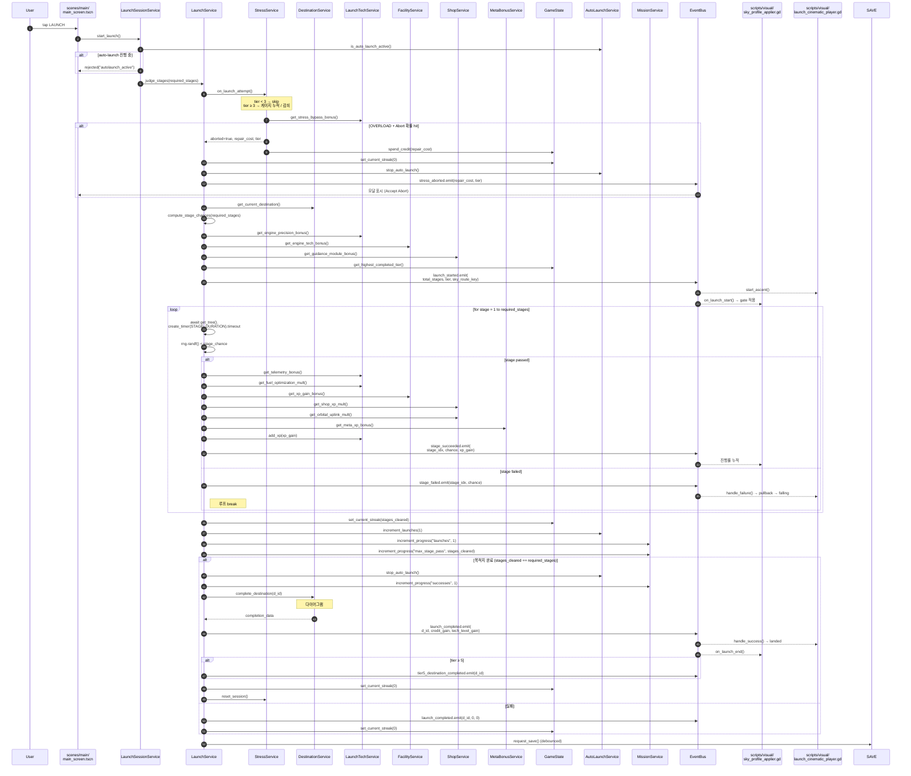

**핵심 포인트**:
- `await create_timer(STAGE_DURATION).timeout`이 스테이지별 대기 → 시네마틱 상승 시간과 동기화 (기본 2.0s)
- 모든 클라이언트 통신은 `EventBus` 시그널로만 진행 — UI는 시그널 구독, 서비스는 emit
- 첫 실패에서 루프 break → `stages_cleared < required_stages` → `current_streak` 리셋
- 발사 결과 확정 후 `SaveSystem.request_save()` 호출 (debounce 적용)

---

## 4. 목적지 완료 팬아웃 (승리 허브)

목적지 완료 1건이 트리거하는 사이드 이펙트 전체. `DestinationService.complete_destination`이 가장 중요한 fan-out 지점.

```mermaid
flowchart TB
    CD["DestinationService.<br/>complete_destination(d_id)"]

    CD -->|"1. 보상 계산"| REW
    subgraph REW ["보상 지급"]
        direction TB
        R1["credit_gain = base_credit<br/>× (1 + facility.mission_reward)<br/>× orbital_uplink_mult<br/>× iap.credit_pack_mult"]
        R2["tech_level_gain = base_tech_level<br/>× (1 + facility.tech_reputation)<br/>× orbital_uplink_mult<br/>× subscription.tl_mult"]
    end
    REW --> GS_ADD["GameState.add_credit() /<br/>GameState.add_tech_level()"]

    CD -->|"2. 카운터"| CNT
    subgraph CNT ["누적 상태"]
        direction TB
        C1["increment_total_wins"]
        C2["set_highest_completed_tier (max)"]
        C3["mark_destination_completed(d_id)"]
    end

    CD -->|"3. Region 체크"| REG
    subgraph REG ["Region (2-2)"]
        direction TB
        RG1{"첫 도달?"}
        RG2["mark_region_visited(region_id)"]
        RG3["region_first_arrival_badge<br/>← RegionResource"]
        RG1 -->|Y| RG2
        RG2 --> RG3
    end
    REG --> BADGE["BadgeService.<br/>check_and_award('region_first_arrival')"]

    CD -->|"4. Mastery 체크"| MAST
    subgraph MAST ["Region Mastery"]
        direction TB
        M1["compute_mastery(after)"]
        M2["compute_mastery(before)"]
        M3{"level up?"}
        M4["mastery_level_up =<br/>RegionResource.get_level_info(lv).name"]
        M1 --> M3
        M2 --> M3
        M3 -->|Y| M4
    end

    CD -->|"5. Best Records"| LB
    subgraph LB ["Best Records (5-4)"]
        direction TB
        LB1["update_best('total_wins')"]
        LB2["update_best('highest_tech_level')"]
        LB3["update_best('best_tier')"]
    end

    CD -->|"6. Win 뱃지"| BADGE2["BadgeService.<br/>check_and_award('win')<br/>(5종 total_wins 임계 체크)"]

    CD -->|"7. Discovery"| DISC
    subgraph DISC ["Discovery (5-1)"]
        direction TB
        D1["on_destination_complete(d_id)"]
        D2["compute_status(after)"]
        D3["compute_status(before)"]
        D4{"우선 변화<br/>COMPLETE / NEW / UPDATED"}
        D1 --> D2
        D1 --> D3
        D2 --> D4
        D3 --> D4
    end

    CD -->|"8. Season Collection"| SEA["SeasonService.<br/>on_destination_complete(d_id)<br/>→ season_xp 가산"]

    CD -->|"9. 자동 진행"| AUTO
    subgraph AUTO ["Auto Advance"]
        direction TB
        A1["next_d_id = get_next()"]
        A2{"total_tech_level ≥<br/>next_dest.required_tech_level?"}
        A3["set_current_destination_id(next)"]
        A4["LaunchTechService.reset_session()"]
        A5["StressService.reset_session()"]
        A1 --> A2
        A2 -->|Y| A3
        A3 --> A4
        A4 --> A5
    end

    CD -->|"10. Telemetry"| TEL["TelemetryService.<br/>log_event('destination_complete', payload)"]

    CD -->|"11. Signal"| SIG["EventBus.<br/>destination_completed.emit(<br/>d_id, completion_data)"]

    SIG --> WS["scenes/ui/win_screen.tscn<br/>(시네마틱 idle 후 표시)"]
    SIG --> SAVE["SaveSystem.request_save()"]

    classDef hub fill:#8c1e5c,stroke:#ff5dac,color:#fff
    classDef reward fill:#8c5a1e,stroke:#ffb84e,color:#fff
    classDef meta fill:#1e8c7a,stroke:#5dffe4,color:#fff
    classDef final fill:#1e4d8c,stroke:#4ea1ff,color:#fff

    class CD hub
    class REW,GS_ADD,CNT reward
    class REG,BADGE,MAST,LB,BADGE2,DISC,SEA,TEL meta
    class AUTO,SIG,WS,SAVE final
```

**관찰 포인트**:
- 11개의 사이드 이펙트가 **순서대로** 실행 (보상 → 카운터 → 메타 → 자동 진행 → 신호)
- 보상 지급이 Region/Badge/Discovery 체크보다 먼저 → 뱃지 조건 판정 시 최신 `total_wins`, `completed_destinations` 반영
- 자동 진행은 마지막 직전 단계 → 세션 리셋(LaunchTech/Stress)도 advance 시에만
- 모든 결과가 `completion_data` Dictionary로 집약되어 `EventBus.destination_completed`로 통과 → UI 1회 갱신, SaveSystem 1회 호출

---

## 5. 3화폐 흐름 (XP / Credit / TechLevel)

각 화폐의 증가/감소 경로. 3축이 완전히 분리되어 교환 경로 없음 (설계 원칙).

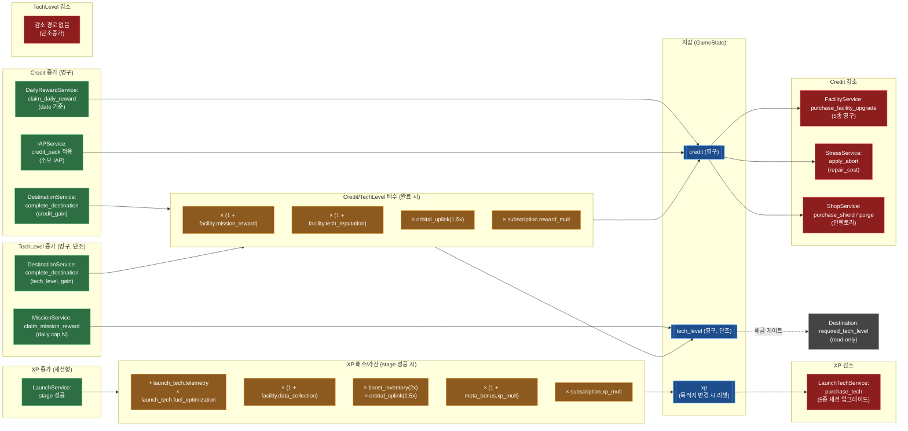

**핵심 원칙**:
- **XP → Credit 변환 없음**
- **Credit → TechLevel 변환 없음**
- **TechLevel 직접 판매 BM 금지** (Subscription 배수만 허용)
- TechLevel은 단조 증가 (리셋 / Prestige / Singularity 미구현)

---

## 6. EventBus 시그널 맵

`scripts/autoload/event_bus.gd` 단일 Autoload가 모든 도메인 시그널을 정의하고 emit/connect를 중계한다. 도메인 서비스는 다른 도메인 서비스를 직접 참조하지 않고 EventBus 시그널을 통해 결합.

```mermaid
flowchart LR
    subgraph Producers ["Producer (서비스)"]
        direction TB
        P_LS["LaunchService / AutoLaunchService /<br/>StressService"]
        P_DEST["DestinationService / DiscoveryService /<br/>BadgeService / SeasonService"]
        P_ECON["GameState / LaunchTechService /<br/>FacilityService / ShopService"]
        P_IAP["IAPService / SubscriptionService /<br/>DailyRewardService / MissionService"]
    end

    EB(["EventBus<br/>(scripts/autoload/event_bus.gd)"])

    subgraph Signals ["시그널 그룹"]
        direction TB

        subgraph LaunchSig ["발사 (Launch)"]
            sg_LS["launch_started(stages, tier)<br/>stage_succeeded(idx, chance, xp)<br/>stage_failed(idx, chance)<br/>launch_completed(d_id, credit, tl)<br/>tier5_destination_completed(d_id)<br/>auto_launch_toggled(enabled, rate)<br/>stress_changed / stress_aborted / stress_reset"]
        end

        subgraph EconSig ["경제 + 진행 (Economy / Progression)"]
            sg_E["xp_changed(value)<br/>credit_changed(value)<br/>tech_level_changed(value)<br/>destination_completed(d_id, data)<br/>region_visited(region_id)<br/>facility_upgraded(id, level)<br/>launch_tech_purchased(id, level)<br/>shop_item_used(item_id)"]
        end

        subgraph MetaSig ["메타 (Meta / Collection)"]
            sg_M["badge_unlocked(badge_id)<br/>discovery_updated(entry_id, status)<br/>mission_progressed(mission_id)<br/>season_xp_changed(value, tier)<br/>season_tier_up(tier)<br/>meta_bonus_applied(bonus_id)"]
        end

        subgraph IAPSig ["수익화 + 저장 (IAP / Save)"]
            sg_I["iap_purchase_succeeded(sku, receipt)<br/>iap_purchase_failed(sku, error)<br/>subscription_changed(active, expire_at)<br/>daily_reward_claimed(date, payload)<br/>save_requested / save_completed / save_failed<br/>offline_progress_applied(summary)"]
        end
    end

    subgraph Consumers ["Consumer"]
        direction TB
        C_UI["scenes/main/main_screen.tscn<br/>scenes/ui/win_screen.tscn<br/>scenes/ui/hud.tscn"]
        C_VIS["scripts/visual/launch_cinematic_player.gd<br/>scripts/visual/sky_profile_applier.gd<br/>scripts/visual/launch_vfx.gd"]
        C_SYS["TelemetryService<br/>SaveSystem"]
    end

    Producers --> EB
    EB --> Signals
    Signals --> Consumers

    classDef prod fill:#2d6e43,stroke:#5dd484,color:#fff
    classDef bus fill:#8c1e5c,stroke:#ff5dac,color:#fff
    classDef sig fill:#1e8c7a,stroke:#5dffe4,color:#fff
    classDef cons fill:#1e4d8c,stroke:#4ea1ff,color:#fff

    class P_LS,P_DEST,P_ECON,P_IAP prod
    class EB bus
    class sg_LS,sg_E,sg_M,sg_I sig
    class C_UI,C_VIS,C_SYS cons
```

**특징**:
- 모든 시그널은 `event_bus.gd` 한 파일에서 `signal foo(arg: Type)` 형태로 선언
- Producer는 `EventBus.launch_started.emit(...)` 호출
- Consumer는 `EventBus.launch_started.connect(_on_launch_started)` 등록
- **Telemetry / Save**는 거의 모든 시그널을 수신 (오프라인 통계 / 자동 저장 트리거)
- 시그널 페이로드는 **읽기 전용** Dictionary 또는 원시값. 객체 참조 전달 금지 (메모리 누수 방지)

---

## 7. SaveSystem JSON 스키마 (영속 데이터)

`SaveSystem`이 직렬화하는 `user://savegame.json`의 계층 구조. 각 도메인 서비스가 `to_save_dict()` / `apply_save_dict(d)`를 구현하고 SaveSystem이 root key별로 dispatch.

```mermaid
flowchart TB
    Save["user://savegame.json<br/>(SaveSystem)"]

    Save --> Header
    Save --> Currency
    Save --> Progression
    Save --> Stress
    Save --> Auto
    Save --> IAP_g
    Save --> Sub
    Save --> Daily
    Save --> Mission
    Save --> Season
    Save --> Meta
    Save --> Disc
    Save --> Badge
    Save --> Best
    Save --> Settings
    Save --> Misc

    Header["헤더<br/>version: 1<br/>saved_at: unix_ts<br/>app_version: '0.x.y'"]

    Currency["currency (3-1)<br/>xp: int<br/>credit: int<br/>tech_level: int"]

    Progression["progression (2-1, 2-2, 2-3)<br/>current_destination_id: String<br/>highest_completed_tier: int<br/>cleared_tiers: PackedInt32Array<br/>completed_destinations: Dict[d_id]→true<br/>visited_regions: Dict[r_id]→true<br/>region_mastery: Dict[r_id]→level<br/>total_wins: int<br/>total_launches: int<br/>current_streak: int<br/>launch_tech: { engine_precision_level,<br/>telemetry_level, fuel_optimization_level,<br/>auto_checklist_level, stress_bypass_level }<br/>(목적지 변경 시 리셋)<br/>facility: { engine_tech, data_collection,<br/>mission_reward, tech_reputation } (영구)"]

    Stress["stress (1-4)<br/>value: float (0~200)<br/>last_decay_at: unix_ts<br/>is_overload_locked: bool<br/>last_abort_fine: int"]

    Auto["auto_launch (1-3)<br/>enabled: bool<br/>rate: float<br/>unlocked: bool (total_launches 게이트)"]

    IAP_g["iap (7-1, 7-2)<br/>non_consumable: Dict[sku]→true (영구)<br/>consumable_log: Array[receipt_hash]<br/>(중복 적용 방지, 최대 200 → 100 트림)<br/>active_boosts: Array[{ kind, expire_at }]<br/>shield_inventory: int<br/>purge_inventory: int"]

    Sub["subscription (7-4)<br/>active: bool<br/>sku: String<br/>expire_at: unix_ts<br/>last_grant_date: 'YYYY-MM-DD'<br/>battle_pass_paid_track_unlocked: bool"]

    Daily["daily_reward (7-3)<br/>last_claim_date: 'YYYY-MM-DD'<br/>streak: int<br/>claimed_today: bool"]

    Mission["daily_mission (5-3)<br/>date: 'YYYY-MM-DD'<br/>missions: Array[{ id, progress, target, claimed }]<br/>daily_tech_level_earned: int"]

    Season["season (6-2)<br/>current_season_id: String<br/>season_xp: int<br/>current_tier: int<br/>claimed_free_tiers: PackedInt32Array<br/>claimed_paid_tiers: PackedInt32Array"]

    Meta["meta_bonus (6-1)<br/>title_owned: Array[String]<br/>title_equipped: String<br/>cosmetics_owned: Array[String]<br/>xp_mult: float (계산값)"]

    Disc["discovery (5-1, Codex 12)<br/>entries_unlocked: Dict[entry_id]→true<br/>stamps: Dict[entry_id]→ts"]

    Badge["badges (5-2, 19종)<br/>unlocked: Dict[badge_id]→ts"]

    Best["best_records (5-4)<br/>total_wins: int<br/>highest_tech_level: int<br/>best_tier: int"]

    Settings["settings<br/>sfx_volume: float<br/>bgm_volume: float<br/>auto_skip_cinematics: bool<br/>language: 'ko' / 'en' / ...<br/>haptic: bool (mobile)"]

    Misc["기타<br/>total_play_time_sec: int<br/>rng_seed: int<br/>last_known_offline_at: unix_ts"]

    classDef header fill:#444,stroke:#aaa,color:#fff
    classDef cur fill:#8c5a1e,stroke:#ffb84e,color:#fff
    classDef prog fill:#2d6e43,stroke:#5dd484,color:#fff
    classDef sess fill:#1e4d8c,stroke:#4ea1ff,color:#fff
    classDef meta fill:#1e8c7a,stroke:#5dffe4,color:#fff
    classDef iap fill:#8c1e1e,stroke:#ff5d5d,color:#fff
    classDef soc fill:#8c1e5c,stroke:#ff5dac,color:#fff

    class Header header
    class Currency cur
    class Progression,Stress,Auto prog
    class Misc,Settings sess
    class Mission,Daily,Disc,Badge,Best meta
    class IAP_g,Sub iap
    class Season,Meta soc
```

**저장 트리거**:
1. **자동 주기**: `Timer` 10초 간격
2. **종료 시**: `Node.NOTIFICATION_WM_CLOSE_REQUEST`, `NOTIFICATION_APPLICATION_PAUSED`(Mobile)
3. **수동**: 설정 화면 "Save Now" 버튼
4. **이벤트 기반**: `destination_completed`, `iap_purchase_succeeded` 직후 (debounce 1초)

**오프라인 진행** (`offline_progress_applied`):
- 로드 시 `now - last_known_offline_at` 델타 계산
- 캡: 8h (`MAX_OFFLINE_SEC = 28800`) — 초과는 잘라냄
- 적용: 평균 발사율 × 델타 → 누락 보상 합산
- UI: 메인 화면 진입 직후 "오프라인 중 획득" 모달

---

## 8. 클라이언트 상태머신 (메인 / 발사 중 / 시네마틱 / 오버레이)

UI/연출 측 4개 상태머신이 공존. EventBus 시그널로 느슨하게 결합.

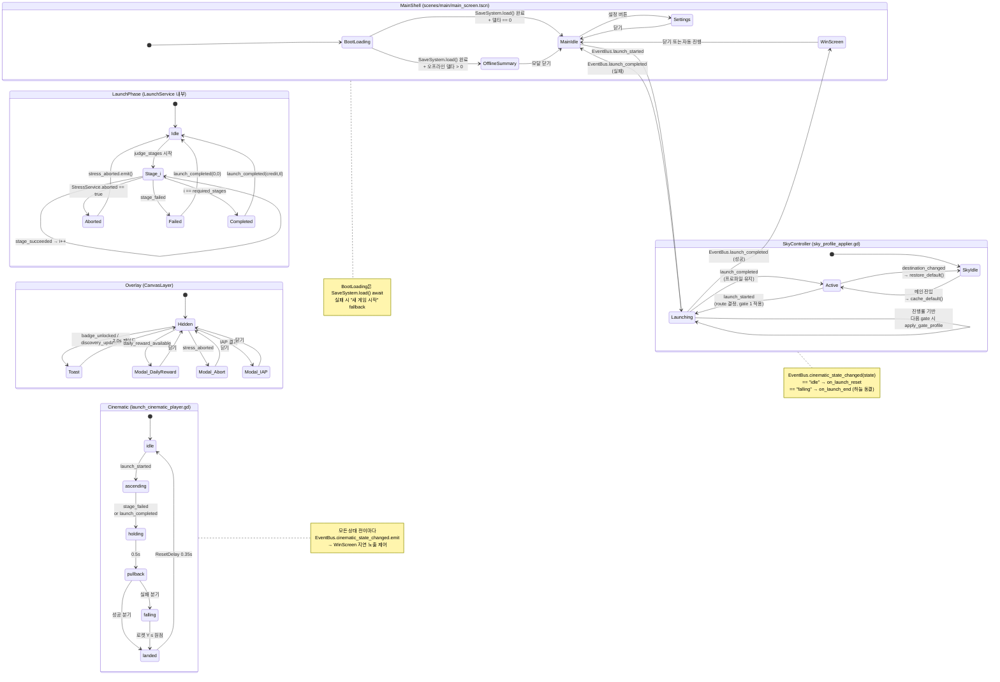

**4개 상태머신의 결합**:
1. **MainShell**: 메인 / 발사 중 / 승리 / 설정 큰 화면 전환
2. **LaunchPhase**: LaunchService 내부 stage 진행 (서비스 측 머신)
3. **Cinematic**: 로켓/카메라 연출 상태 (가장 세밀)
4. **SkyController**: 하늘/조명 상태
5. **Overlay**: CanvasLayer 위 토스트/모달 (다른 머신과 독립)

**결합 방식**: 모든 결합은 `EventBus`를 경유. UI 노드는 다른 노드를 직접 참조하지 않고 시그널 구독. 싱글 클라이언트가 모든 게임 로직의 단일 권위.

---

## A. 플랫폼별 빌드 매트릭스

Godot 4.6 export preset 별 분기와 플랫폼 SDK 의존성. 단일 코드베이스에서 conditional autoload로 백엔드 교체.

```mermaid
flowchart TB
    Code["scripts/<br/>star-reach 단일 코드베이스"]

    Code --> Common
    subgraph Common ["공통 Autoload (모든 플랫폼)"]
        direction LR
        EB["EventBus"]
        SAVE["SaveSystem<br/>(user:// JSON)"]
        GS["GameState"]
        TEL["TelemetryService<br/>(Local 로그)"]
    end

    Code --> Branches

    subgraph Branches ["플랫폼별 IAP / 백엔드 어댑터"]
        direction TB

        subgraph Android ["Android (Google Play)"]
            A1["scripts/iap/<br/>android_billing_adapter.gd"]
            A2["GodotGooglePlayBilling<br/>플러그인"]
            A3["옵션 백엔드:<br/>Google Play Games"]
            A4["옵션 백엔드:<br/>Firebase Analytics"]
            A5["export preset:<br/>android"]
        end

        subgraph iOS ["iOS (StoreKit)"]
            I1["scripts/iap/<br/>ios_storekit_adapter.gd"]
            I2["GodotIOSStoreKit2 플러그인"]
            I3["옵션 백엔드:<br/>Game Center"]
            I4["옵션 백엔드:<br/>Firebase Analytics"]
            I5["export preset:<br/>ios"]
        end

        subgraph SteamW ["Steam Windows"]
            S1["scripts/iap/<br/>steam_microtxn_adapter.gd"]
            S2["GodotSteam<br/>(addons/godotsteam/win64)"]
            S3["옵션 백엔드:<br/>Steam Achievements"]
            S4["옵션 백엔드:<br/>Steam Stats"]
            S5["export preset:<br/>windows"]
        end

        subgraph SteamL ["Steam Linux / Steam Deck"]
            L1["scripts/iap/<br/>steam_microtxn_adapter.gd"]
            L2["GodotSteam<br/>(addons/godotsteam/linux64)"]
            L3["옵션 백엔드:<br/>Steam Achievements"]
            L4["옵션 백엔드:<br/>Steam Stats"]
            L5["export preset:<br/>linux"]
        end
    end

    IAPSvc["IAPService<br/>(scripts/autoload/iap_service.gd)"]
    A1 --> IAPSvc
    I1 --> IAPSvc
    S1 --> IAPSvc
    L1 --> IAPSvc

    IAPSvc --> EB

    classDef code fill:#1e4d8c,stroke:#4ea1ff,color:#fff
    classDef common fill:#444,stroke:#aaa,color:#fff
    classDef android fill:#2d6e43,stroke:#5dd484,color:#fff
    classDef ios fill:#1e8c7a,stroke:#5dffe4,color:#fff
    classDef steam fill:#8c1e1e,stroke:#ff5d5d,color:#fff
    classDef svc fill:#8c1e5c,stroke:#ff5dac,color:#fff

    class Code code
    class Common,EB,SAVE,GS,TEL common
    class A1,A2,A3,A4,A5 android
    class I1,I2,I3,I4,I5 ios
    class S1,S2,S3,S4,S5 steam
    class L1,L2,L3,L4,L5 steam
    class IAPSvc svc
```

**선택 규칙** (`IAPService._ready()`):
- `OS.has_feature("android")` → AndroidBillingAdapter
- `OS.has_feature("ios")` → IOSStoreKitAdapter
- `OS.has_feature("windows")` 또는 `OS.has_feature("linuxbsd")` + Steam 환경 → SteamMicrotxnAdapter
- 그 외 (에디터 / Web) → MockIAPAdapter (개발 전용, 즉시 성공/실패 시뮬)

**SKU 통합 카탈로그**:
- 단일 `data/iap/iap_catalog.tres`에 SKU 목록 + 플랫폼별 ID 매핑
- `IAPService.purchase(sku_id)` 호출 → 어댑터가 플랫폼 ID로 변환 후 결제

---

## B. IAP 플로우

결제 트랜잭션이 어댑터 → IAPService → GameState 효과 적용까지의 흐름. 멱등성(중복 적용 방지)이 핵심.

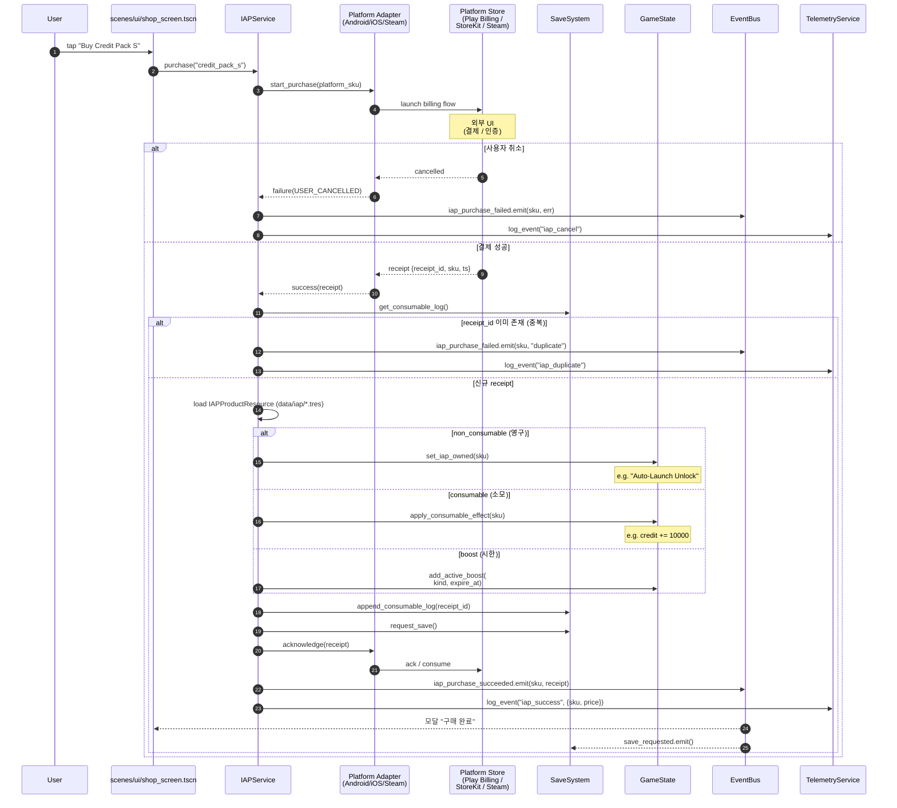

**멱등성 키**:
- `consumable_log: Array` — 마지막 200건 receipt_id 보관, 100건으로 트림
- `non_consumable: Dict[sku]→true` — 같은 sku 재구매 시 즉시 "already_owned" 응답

**부정 검증** (옵션):
- Steam: `ISteamUserStats.RequestUserStats` + 영수증 검증 (서버 없이도 GodotSteam에서 처리)
- Google Play: `BillingClient.queryPurchasesAsync()` 로 복원 + 서명 검증
- Apple: `Transaction.verificationResult` (StoreKit 2)

**오프라인 결제 복원** (앱 재시작):
- `IAPService._ready()`에서 어댑터에 `query_purchases()` 호출 → 미적용 receipt 발견 시 위 플로우 재실행

---

## C. SaveSystem 마이그레이션

스키마가 변경될 때 (`version` 필드 증가) 구버전 JSON을 신버전으로 변환하는 흐름. `SaveSystem._migrate()`가 단계별 마이그레이션 함수를 chain.

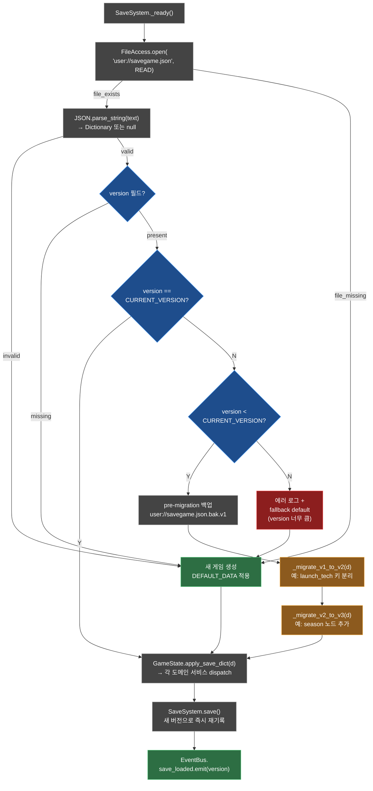

**마이그레이션 규칙**:
1. **버전당 하나의 함수**: `_migrate_vN_to_vN1(d: Dictionary) -> Dictionary`
2. **chain 호출**: `version=1`이면 `_migrate_v1_to_v2 → _migrate_v2_to_v3 → ...` 순차
3. **idempotent**: 동일 dict 재호출해도 동일 결과
4. **백업 우선**: 마이그레이션 시작 전 `savegame.json.bak.v{N}` 생성, 실패 시 복원
5. **schema 검증**: 마이그레이션 종료 후 필수 키 존재 확인 → 없으면 default 채움

**예시: v1 → v2** (가상):
- v1: `launch_tech_levels: { ep, tel, fo, ac, sb }` (단일 Dict)
- v2: `progression.launch_tech: { engine_precision_level, telemetry_level, ... }` (이름 명확화)
- 마이그레이션: 키 매핑 + 위치 이동 + 기본값 0 채움

---

## 문서 간 탐색

- 각 시스템 상세: [`docs/systems/INDEX.md`](./INDEX.md)
- 본 아키텍처 다이어그램의 기반이 되는 정본 기획 문서: `docs/*.md` (특히 `prd.md`, `plan.md`, `rocket_launch_implementation_spec.md`)
- 구현 코드: `star-reach/scripts/autoload/*`, `star-reach/scripts/services/*`, `star-reach/scenes/*`, `star-reach/data/*.tres`
- Godot 코딩 규칙: [`star-reach/CLAUDE.md`](../../star-reach/CLAUDE.md)

## Mermaid 렌더링 확인 방법

1. GitHub: `.md` 파일 뷰어가 Mermaid 자동 렌더링
2. VS Code: `Markdown Preview Mermaid Support` 확장 설치
3. 로컬 터미널: `mmdc -i ARCHITECTURE.md -o out.html` (mermaid-cli)
4. 웹: `https://mermaid.live` 에 코드 블록 복사-붙여넣기
